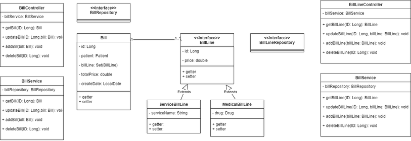

# Web API

This project implement diagram below.



## Setup

- Config your username, password, database

```yaml
spring:
  datasource:
    url: jdbc:mysql://${MYSQL_HOST:localhost}:3306/db_bill
    username: root
    password: root
  jpa:
    hibernate:
      ddl-auto: update

```

- Run command( requite install maven in your system) `mvn spring-boot:run`